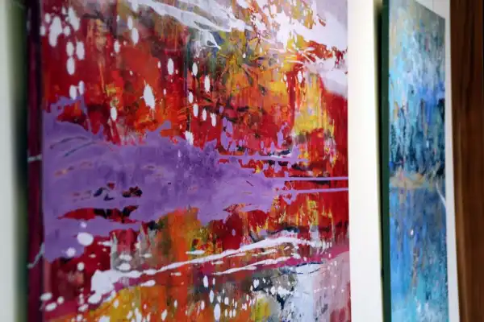
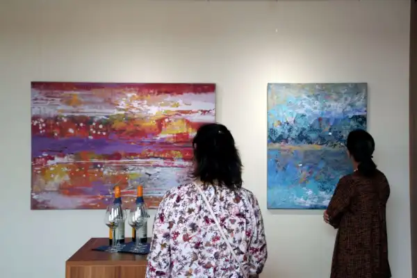
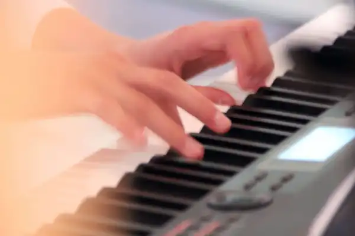

Eröffnet am 20.06.2018 im IAB – Institut für angewandte Bauforschung in Weimar-Tröbsdorf Der gut besuchte Abend wurde musikalisch umrahmt von zwei jungen Künstlern. Die 12 jährige Elisabeth Maria Wild (Violine) vom Musikgymnasium Belvedere und der 16 jährige Andreas Nicolas Deri (Klavier) von der Hochschule für Musik Franz Liszt gaben ihr gemeinsames Konzertdebüt und verzauberten die Gäste mit den Werken von Friedrich Seitz, Konzert D-dur, op.15, 1. Satz und Pablo de Sarasate, Reverie, op.4.“

<!-- 

 -->
